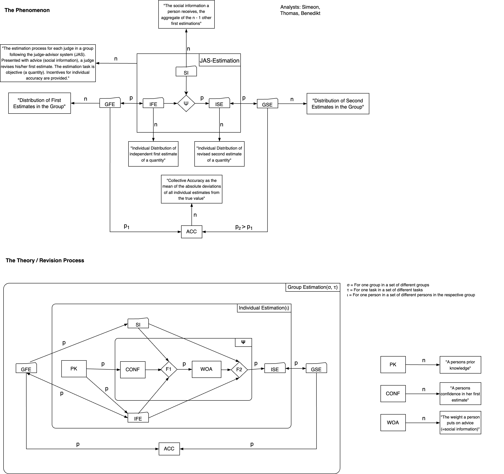
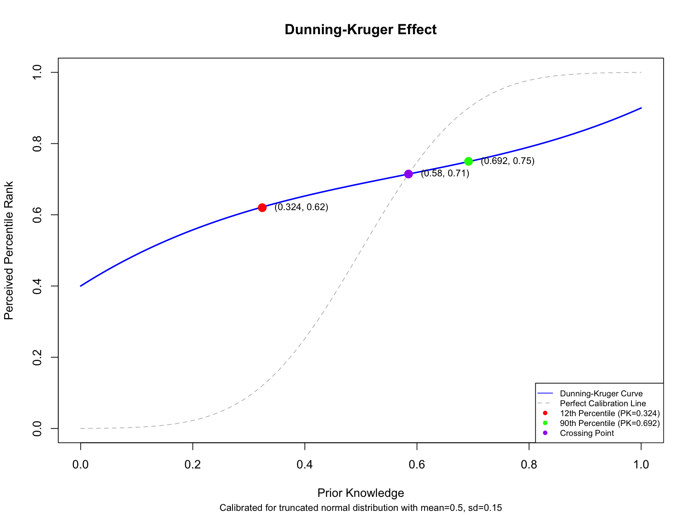
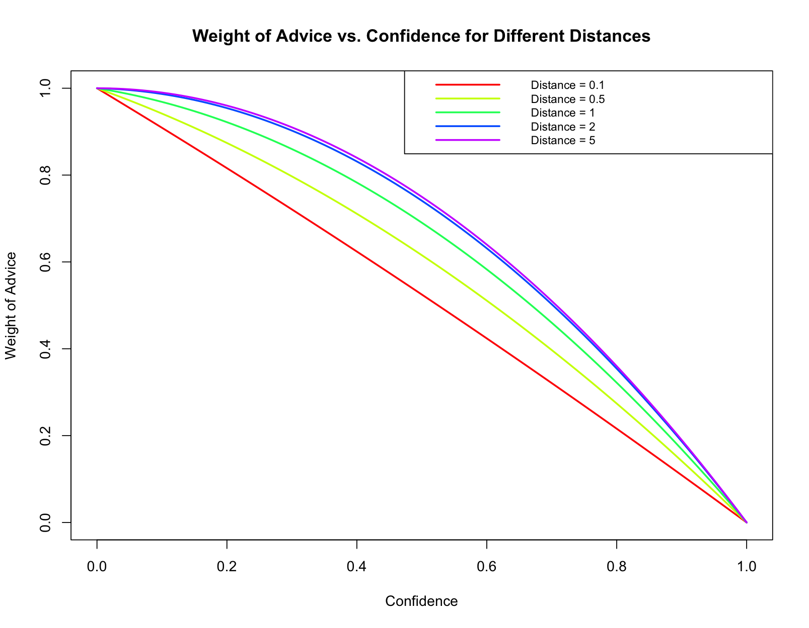
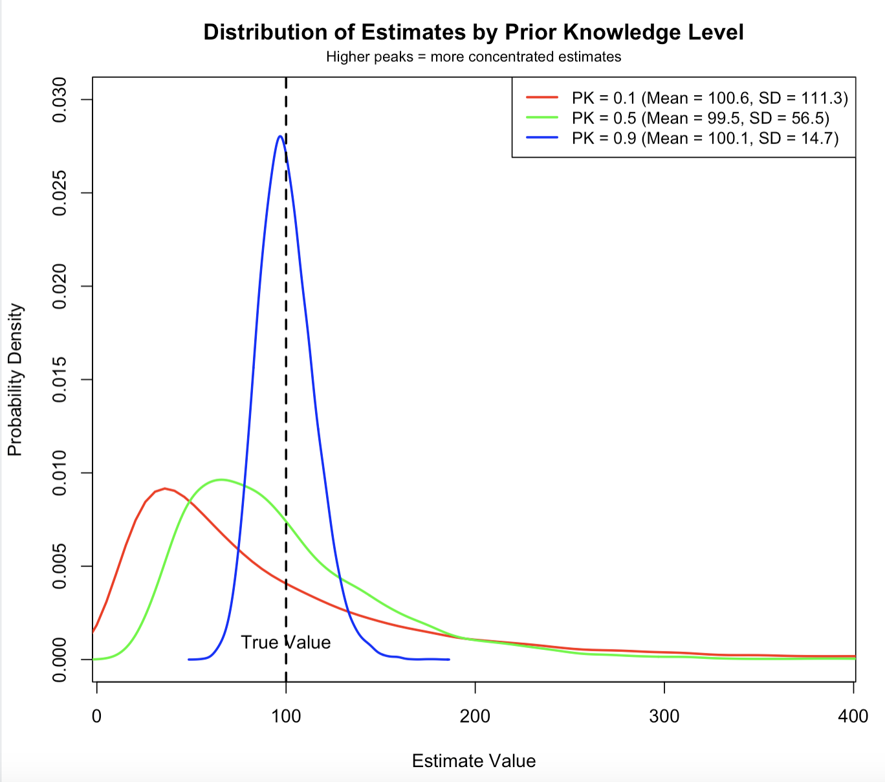
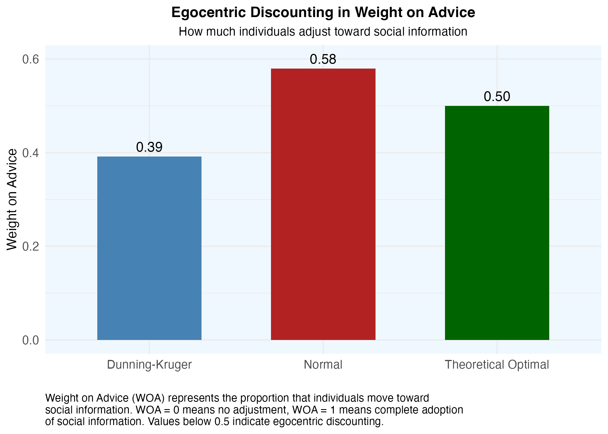
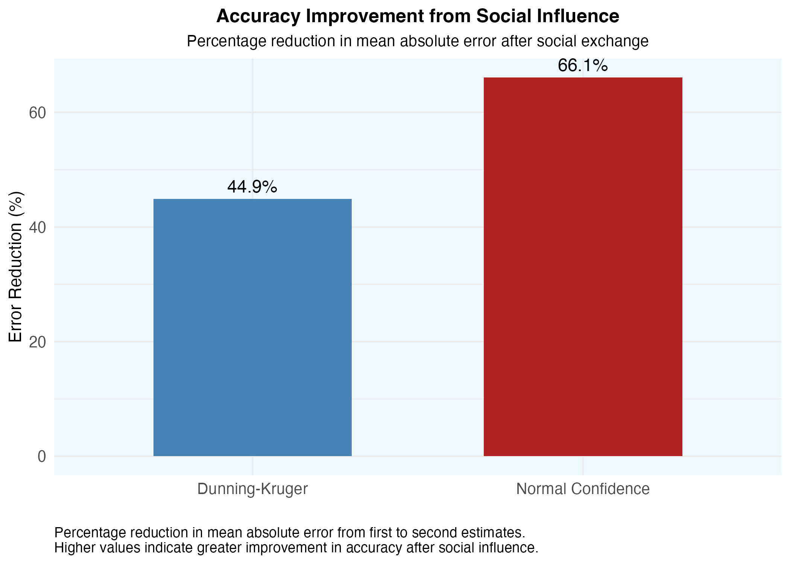
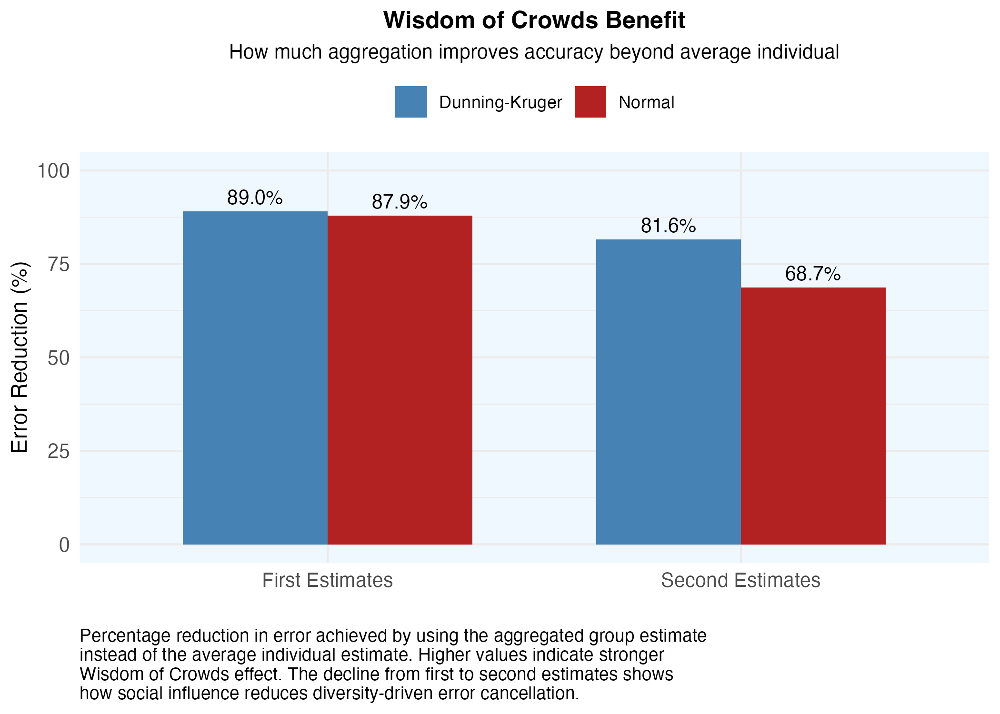

```{r setup, include = FALSE}
library("papaja")
r_refs("r-references.bib")
```

```{r analysis-preferences}
# Seed for random number generation
set.seed(40)
knitr::opts_chunk$set(cache.extra = knitr::rand_seed)
```

# Objective

This report aims to formalize theoretical assumptions regarding the effects of social influence on group accuracy and wisdom of crowds potency within the Judge-Advisor System (JAS) paradigm. Additionally, we will examine how varying degrees of the Dunning-Kruger effect (where individuals with low expertise overestimate their abilities while those with high expertise underestimate theirs) might impact these dynamics.

# Verbal Introduction

The wisdom of crowds effect, first observed by Galton in 1907, refers to the phenomenon where the aggregation of independent individual judgments can produce estimates that are more accurate than most individual judgments [@jaylesHowSocialInformation2017]. This effect has been widely documented across various domains, including prediction markets, political forecasting, and general knowledge estimation tasks [@surowieckiWisdomCrowdsWhy2004]. Central to the effect is the notion that cognitive diversity among individuals leads to error cancellation when estimates are aggregated [@raderAdviceFormSocial2017].

The judge-advisor system (JAS) paradigm offers a structured approach to studying how individuals incorporate advice into their decision-making [@sniezekCueingCognitiveConflict1995]. In this paradigm, participants (judges) provide an initial estimate, receive advice (typically in the form of estimates from others), and then have the opportunity to revise their original estimate. This experimental design allows researchers to quantify the extent to which people incorporate others' input. This process is fundamental to many real-world scenarios, from professional consultations to everyday social interactions [@baileyMetaanalysisWeightAdvice2023].

While traditional wisdom of crowds theory emphasizes the importance of fully independent judgments for maximizing collective accuracy [@lorenzHowSocialInfluence2011], recent evidence suggests that under certain conditions, social influence may actually improve group estimation accuracy [@jaylesHowSocialInformation2017]. It is hypothesized that this is the case, because subjects can use the power of the Wisdom of Crowds by adjusting 50% towards whatever advice they receive [@baileyMetaanalysisWeightAdvice2023]. In practice, they adjust by only 0.39, thereby weighing their own opinion more highly (egocentric discounting) [@baileyMetaanalysisWeightAdvice2023]. 

# Relevant Phenomena

Studies have found that within the JAS paradigm, the accuracy of individual estimates and aggregated group estimates is higher after subjects have received advice, than for their first, fully independent guesses. Subjects tend to integrate the estimate received as advice into their second guess, moving toward it.

The analysis of strength of evidence as well as generalizability for this phenomenon heavily depend on which studies we include during our limited search. Most importantly, it depends on whether we regard the meta-analysis of Baileys et al. as representative of our phenomenon. In their work, they find the robust effect, that people move towards the advice they receive in their second estimates, but they also state that they did not include whether this move resulted in increased or decreased accuracy, due to concerns of having to exclude too many studies from their dataset. Because of this lack of accuracy measurements, we exclude their paper from our evaluation.

## Strength of Evidence

The phenomenon of improved estimation accuracy after receiving advice shows moderate evidence across multiple studies. The evidence strength is supported by methodologically sound experimental designs with standardized protocols, controlled variables, and adequate sample sizes (for example 520 participants in Becker, 279 in Gürçay). All studies except for [@lorenzHowSocialInfluence2011] demonstrate statistical significance for the basic effect of accuracy improvements. In a re-analysis of their data, Gürçay et al. later do find an effect with different outcome measurements.

## UTOS

For Units, evidence comes primarily from university students, limiting generalizability. Treatment variations show consistency across different forms of social information (statistical feedback, peer estimates, network influence, and confidence information), with effects persisting across these variations. Even group discussions yielded a positive effect [@gurcayPowerSocialInfluence2015]. Based on this sample of studies, Treatments seem to be relatively generalizable.

Outcome measurements vary (mean absolute error, percentage deviation, log-transformed differences), yet capture improvement in accuracy post-advice, except in the case of [@lorenzHowSocialInfluence2011]. The fact that [@gurcayPowerSocialInfluence2015] can simply identify an effect in the data of [@lorenzHowSocialInfluence2011] due to different measurements and analyses indicates limited generalizability across outcomes.

Settings have been tested across different countries (France, Japan) and modalities (digital platforms, laboratory environments), though primarily in controlled experimental contexts rather than naturalistic settings.

The phenomenon can be considered low to moderately robust. It demonstrates consistency across different operationalizations of treatments in controlled settings, however, its robustness is limited by homogeneous sampling, artificial interaction paradigms, and lack of evidence from naturalistic environments where more complex social dynamics might influence the effect.

# Core Constructs

The theory explains how individuals incorporate social information into their estimates. The key paradigm (JAS) involves individuals making an initial estimate (First Estimate), receiving social information from others, and then producing a revised estimate (Second Estimate).

* Prior Knowledge (PK) represents an individual's expertise regarding the estimation task, ranging from 0 (no knowledge) to 1 (expert) [PK1, PK2]. The distribution of this knowledge across a group (GPK) follows a truncated normal distribution [PK1, PK2, PK3].

* Confidence (CONF) reflects an individual's trust in their own estimate and is directly determined by their prior knowledge [CONF1, CONF2, CONF3]. It is on a scale of 0 to 1, where 0 means they don't believe in their estimate at all and 1 means they are fully confident in its accuracy. We used a simplification and set CONF = PK in our base model, because they closely related [@jaylesHowSocialInformation2017].

* First Estimates (IFE) follow a lognormal distribution where the variance decreases with higher prior knowledge [FE1, FE2]. More knowledgeable individuals produce less variable estimates closer to the true value [PK3].

* Social Information (SI) is calculated as the mean of other group members' first estimates [SINFO1].


* Weight on Advice (WOA) is the central mechanism determining how individuals combine their first estimate with social information [WOA1, WOA2, WOA3, WOA4]. WOA is influenced by:
  * An individual's confidence in their first estimate [CONF1, CONF2]
  * The perceived distance between their estimate and the social information [D1, D2, D4, D5]

* Second Estimates (ISE) are calculated as a weighted average of an individual's first estimate and the social information [WOA1-WOA7].

* Collective Accuracy (ACC) measures how close the group's estimates are to the true value, calculated as the mean absolute deviation from the true value.

Even though not explicitly mentioned in our VAST Model, we also aim to investigate the Wisdom of Crowds effect, as well as the tendency for egocentric discounting, meaning the phenomenon that individuals tend to have a WOA < 0.5, meaning they value their own estimate more highly than the social information of the group [EGO1, EGO2]. We aim to test in our simulations, whether and under what circumstances WOC and Egocentric Discounting can be shown to exist.

For our extension, we incorporate the Dunning-Kruger effect into our confidence calculation, based on the initial paper from 1999. We interpret the Dunning-Kruger Effect to mean novices being significantly more confident in their knowledge than would be reasonable for them, while experts are less confident than would be reasonable for them [DK1, DK2]. Dunning & Kruger posit, that this happens, because low-knowledge subjects also lack the metacognitive skills to realize their lack of skill [DK3].

## VAST Display
In our VAST display we tried to separate between the overall paradigm and the theoretical model according to which changes in accuracy occur.

```{r, echo = FALSE, include = TRUE, fig.pos="H", out.width="90%"}

```

# Theory Formulation

Our model starts with a group of subjects, who each have a different prior knowledge with regards to the estimation task [PK2]. Those with higher prior knowledge have more accurate first estimates and will be more confident in them, whereas those with lower prior knowledge will have less accurate ones, while being less confident. The core of our theory lies within the revision coefficient [@beckerNetworkDynamicsSocial2017]. Confidence and prior knowledge should be highly correlated (without the Dunning-Kruger effect), so accurate individuals will not be moved much by potentially inaccurate social information, while less knowledgeable individuals shift more toward advice. As long as this is the case, we should find improvements in group accuracy.

This mechanism is modeled via our calculation of Weight of Advice, which determines by what percentage subjects move towards the advice they received from their initial estimate. Highly confident individuals will generally stay close to their initial estimate, whereas those with low confidence will weight advice more highly. A second factor is distance between what people's first estimate was and what advice they are receiving. Low distance leads to a decreased weight of advice [@raderAdviceFormSocial2017], whereas high distance makes people doubt their first estimate more.

We then calculate the accuracy for both first estimates and second estimates in order to determine 1. whether the groups second estimates are more accurate (closer to the true value) than their first estimates and 2. how strong a potential Wisdom of Crowds effect is.

Because individuals do move toward social information, their estimation diversity decreases [@lorenzHowSocialInfluence2011]. This should in theory also diminish the potency of the Wisdom of Crowds effect for second estimates, i.e. aggregating will lead to less pronounced improvements in comparison to the first estimates.

By including the Dunning-Kruger effect, we effectively water down the strong correlation between prior knowledge and confidence. Those with lower prior knowledge have too much confidence given how little knowledge they have, whereas experts are less confident in their judgements than they should be [@krugerUnskilledUnawareIt1999]. We predict that for extreme overconfidence of novices and extreme underconfidence of experts, social influence will be detrimental to group accuracy.

# Formal Model Development
All code and materials have been uploaded to the following repository:
In developing our formal model we made multiple simplifications and also deviated from the theory.
The model uses a deterministic function combining confidence and distance between estimates, whereas actual human weight assignment includes additional factors like advisor characteristics [WOA3, WOA4] and social dynamics not captured here [WOA7].
Furthermore, some authors report a reactance effect when individuals notice a high distance between their estimate and received advice [D6]. We limited ourselves to not modeling this and assumed that the higher the distance between our initial estimate and the social information, the more people will move towards the advice, due to fear of being totally wrong [D2, D4].


## Prior Knowledge to Confidence
In our basic modeling of confidence, we assumed that CONF = PK [CONF3]. In reality CONF would most likely also follow a distribution across intra-individual "samplings" of it, while also being influenced by different personality tendencies [WOA7]. Additionally, in our Dunning-Kruger extension, we pegged the mapping to trace the percentile over- and underestimations found in the initial Dunning-Kruger paper [DK1, DK2, DK3], based on truncated normal distribution of prior knowledge, with mean=0.5 and SD=0.15. We made sure to identify which percentiles correspond to which levels of prior knowledge (for example percentile=0.12 <-> PK=0.324), but we did not make it dynamically adapt to different kinds of prior knowledge distributions.

```{r, echo = FALSE, include = TRUE, fig.pos="H"}

```
## Weight of Advice
This function determines how much individuals are influenced by advice based on their confidence and the distance between their first estimate and social information [WOA1, WOA2]. It calculates a log-based distance measure, then adjusts the weight using confidence values [CONF1, CONF2] and a tanh transformation. Higher confidence decreases the weight given to advice [REV4, REV5], while larger distances (with tanh transformation) can increase it [D2, D4]. The result is constrained between 0 and 1.
```{r, echo = FALSE, include = TRUE, fig.pos="H"}

```
## Psi
Psi integrates social information with an individual's first estimate to determine the expected second estimate. It uses the Weight of Advice to calculate how much an individual relies on social information versus their own initial judgment. The expected second estimate is a weighted average.

## Prior Knowledge to First Estimate
The relationship is logarithmic - higher prior knowledge leads to more accurate estimates with less variance [PK3, FE1, FE2]. Specifically, estimation error standard deviation decreases linearly with prior knowledge. Estimates are drawn from a lognormal distribution centered around the true value, with the spread determined by the individual's prior knowledge.

```{r, echo = FALSE, include = TRUE, fig.pos="H"}

```

# Formal Model Evaluation
To evaluate our model's predictions, we conducted simulations examining key phenomena: accuracy improvement through social influence, potency of Wisdom of Crowds (WOC) effects, and egocentric discounting. We used a truncated normal distribution for prior knowledge (mean=0.5, SD=0.15) across all simulations, with 100 individuals and 100 trials per condition.

## Weight of Advice
Our results indicate that our basic model, with a direct mapping of PK to CONF, results in a WOA of 0.58, higher than the optimal 0.5. Interestingly, our revised mapping based on the initial paper on the Dunning-Kruger effect replicates the tendency for egocentric discounting, with the same WOA found by [@baileyMetaanalysisWeightAdvice2023] at 0.39.

```{r, echo = FALSE, include = TRUE, fig.pos="H"}

```

## Do groups become more accurate after social influence?
Social influence does not improve the already accurate group mean, the averages of first and second estimates are extremely close. Our results do show that both simple and Dunning-Kruger confidence calculations lead to individual accuracy improvements, with the Dunning-Kruger effect significantly reducing benefits from social influence. Additionally, individual estimates always improve through social influence across all simulated trials.

```{r, echo = FALSE, include = TRUE, fig.pos="H"}

```

## Does WOC potency decrease after reception of social information?
Yes, the benefits of the Wisdom of Crowds decrease after social information exchange in both simple and Dunning-Kruger confidence models. This reduction occurs because social influence decreases estimate diversity, weakening error cancellation effects while simultaneously improving individual accuracy. The fact that we see more of a benefit of WOC in the Dunning-Kruger model is explained by the greater diversity preservation that occurs when some individuals (overconfident novices) resist social influence while others (underconfident experts) are influenced more. This heterogeneity in advice integration partially preserves the diversity necessary for error cancellation.

```{r, echo = FALSE, include = TRUE, fig.pos="H"}

```

# Discussion
Even though the literature already had a high degree of formalization, it was still challenging to extract out theoretical elements. We faced the problem of not being clear enough on the phenomenon we wanted to model, whether it was on the individual or on the group level. It would have been simpler to just look at the work of @baileyMetaanalysisWeightAdvice2023 and model only the mechanisms behind shifting toward advice, without concerning ourselves with group level accuracy and Wisdom of Crowds. This made our model and our research objective significantly more complex. Nonetheless, it is still rewarding to now have a more comprehensive model and also to be able to find the same egocentric discounting factor in our simulated data, with the Dunning-Kruger effect implemented.

It was very unexpected just how many tiny decisions go into formalizing a theory, how many additional assumptions need to be agreed upon and how these seemingly small decisions can lead to vastly different outcomes. The fact that formalization feels so overwhelming also goes to show how real-world studies have immense degrees of freedom, which can easily lead to different results, depending on methods, frameworks and measures used. We also found different effects in the literature, for example the reactance effect of high distance, which was not found by all papers surveyed.

Our group discussed a lot about how to properly integrate distance, confidence and in the beginning even other factors into a weight of advice calculation. It was challenging to find functions in this multi-dimensional space, which fit all the criteria and which everyone was happy with. Even though the VAST Model was helpful initially as a tool to organize our thinking, we found it more and more limiting as time went one. At times we stopped thinking about the actual phenomenon and just treated the VAST framework as a ground truth, which artificially limited our creativity and ability to connect the dots. All things considered though, formalizing a complex phenomenon like this has been a challenging but also very enlightening endeavor.

\newpage

# References

::: {#refs custom-style="Bibliography"}
:::

```{=latex}
\includepdf[pages=-,pagecommand={\section*{Appendix A}}]{Final Construct Source 23.03.25.pdf}
```

```{=latex}
\includepdf[pages=-,pagecommand={\section*{Appendix B}}]{Variable Table.pdf}
```
